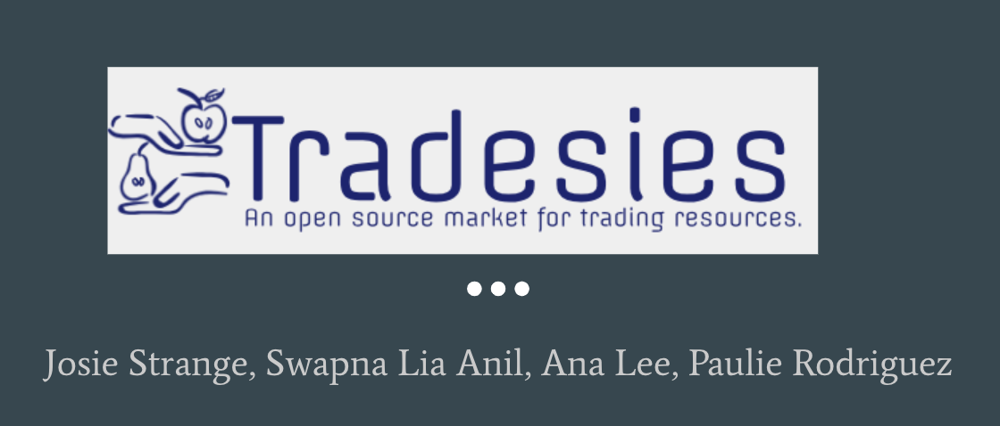

### Overview
---
An app that allows users to give and receive with no costs and to give a greater sense of users helping each other in their own communities.

### Getting Started
---
* Clone down repo ``` git clone git@github.com:liaswapna/Tradesies.git```.
* Navigate to the repo ```cd Tradesies```.
* Run command ```npm install``` in Terminal or GitBash
* Run command ```node server``` to start the server.

### Technologies Used
---
* HTML5
* CSS3
* Materialize
* Bulma UI
* Node.js
* Express
* Express-handlebars
* Nodemailer
* mysql
* Sequelize

### Dependencies
---
```js
{
    "body-parser": "^1.18.3",
    "dotenv": "^6.0.0",
    "express": "^4.16.3",
    "express-handlebars": "^3.0.0",
    "moment": "^2.24.0",
    "mysql2": "^1.6.4",
    "nodemailer": "^5.1.1",
    "sequelize": "^4.41.2"
}
```

### Demos
---
* Tradesies
    * [Heroku Link]()

### Contributors :sparkles:
---


