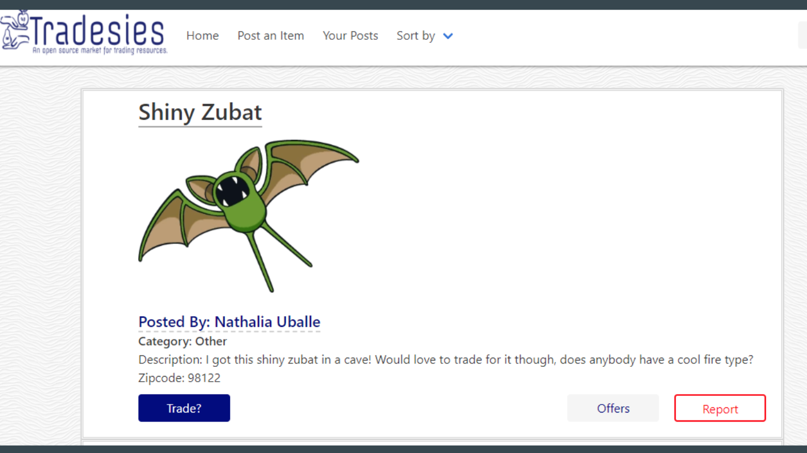
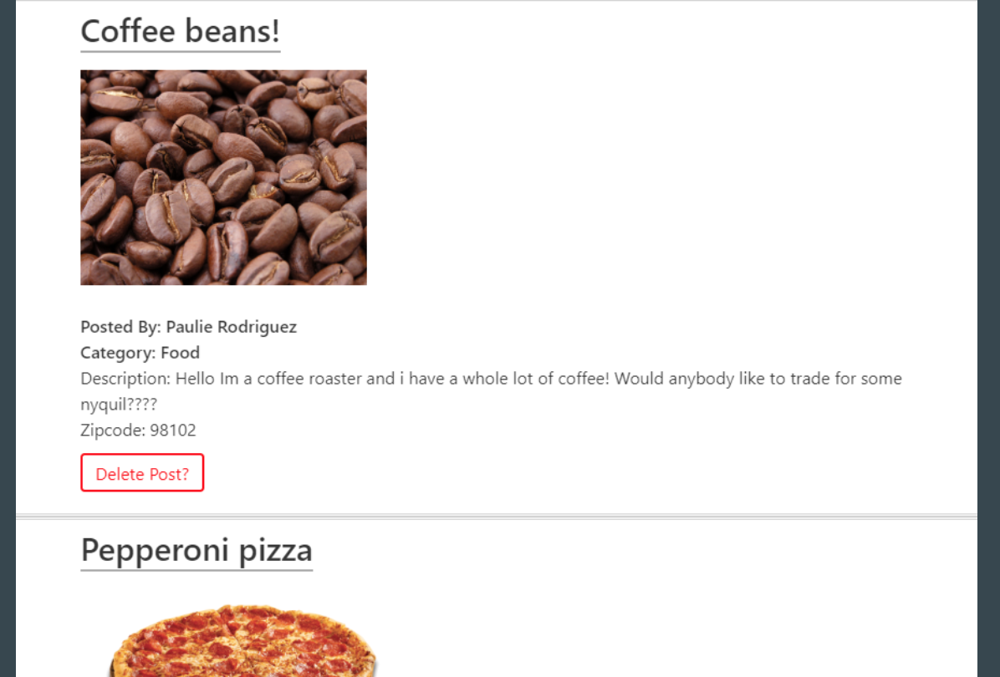

### Overview
---
An app that allows users to give and receive with no costs and to give a greater sense of users helping each other in their own communities.

### Getting Started
---
* Clone down repo ``` git clone https://github.com/Jostrange/Project2Giraffe.git```.
* Navigate to the repo ```cd Project2Giraffe```.
* Run command ```npm install``` in Terminal or GitBash
* Run command ```node server``` to start the server.

### Technologies Used
---
* HTML5
* CSS3
* Materialize
* Bulma UI
* Bootstrap
* Node.js
* Express
* Express-handlebars
* mysql
* Sequelize

### Dependencies
---
```js
{
"dotenv": "^6.2.0",
"express": "^4.16.4",
"express-handlebars": "^3.0.0",
"mysql": "^2.16.0",
"mysql2": "^1.6.4",
"sequelize": "^4.42.0"
}
```

### Contributors :sparkles:
---

[Ana Lee](https://github.com/anabellee25)

[Paulie Rodriguez](https://github.com/jorgebustamante) 

[Swapna Lia Anil](https://github.com/liaswapna)

[Josie Strange](https://github.com/Jostrange)

### Screenshot
---
* User Page view:

    

* User specific posts View 

    

@Tradesies
