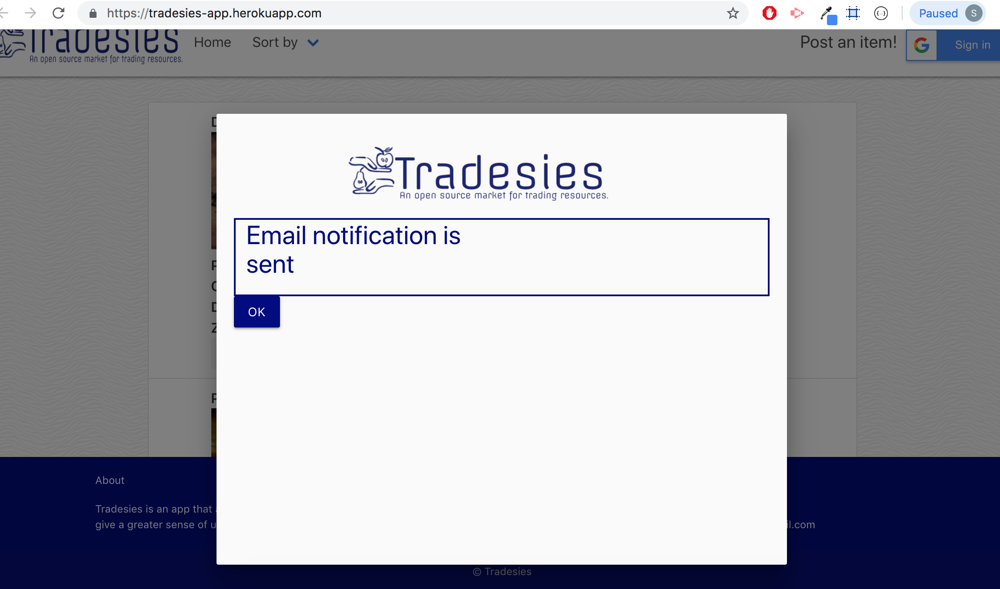

### Overview
---
An app that allows users to give and receive with no costs and to give a greater sense of users helping each other in their own communities.

### Getting Started
---
* Clone down repo ``` git clone git@github.com:liaswapna/Tradesies.git```.
* Navigate to the repo ```cd Tradesies```.
* Run command ```npm install``` in Terminal or GitBash
* Run command ```node server``` to start the server.

### Technologies Used
---
* HTML5
* CSS3
* Materialize
* Bulma UI
* Node.js
* Express
* Express-handlebars
* Nodemailer
* mysql
* Sequelize

### Dependencies
---
```js
{
    "body-parser": "^1.18.3",
    "dotenv": "^6.0.0",
    "express": "^4.16.3",
    "express-handlebars": "^3.0.0",
    "moment": "^2.24.0",
    "mysql2": "^1.6.4",
    "nodemailer": "^5.1.1",
    "sequelize": "^4.41.2"
}
```

<<<<<<< HEAD
### Demos :earth_asia:
---
* Tradesies
    * [Heroku Link](https://tradesies-app.herokuapp.com)

### Screenshot
---
*   Home page of the Tradesies app.This page is accessible to all the users including Guest users.
    *   The guest user can view the feeds on the site.
    *   The user can click the Trade Button to make offer on the post.
    *   The user can also use Report Button if they doubt the post is a spam.
    *   The user can filter the feed depending on what they are looking for.
    *   The user can also sign in if they want to post an item.

    
*   User logged in page of the Tradesies app.
    *   Logged-in user have access to all the previleges given for the guest users and  more
    *   Logged-in user can make their own posts.
    *   Logged-in user can filter the feeds
    *   Logged-in user can also access their post lists and make changes.
    *   logged-in user can also signout.

    
*   Your post page of the Tradesies app.
    *   This page is only accessed by logged-in user.
    *   This page contains all the lists of posts they made.
    *   The user can filter their post using sortby dropdown.
    *   The user can update and delete their post lists.

    
*   404 page of the Tradesies app.
    *   This page is shown when the data is not found 
    *   Proper message is displayed on the page by passing in message dynamically depending on the situation and is displayed on the page.
    *   Link reference is also passed dynamically depending on where to redirect the page.

    
*   Trade modal view of the Tradesies app.
    *  Trade modal is used to make an offer .
    *  It takes in the input values and is emailed to the post owner.
    *   Email send notification modal is then invoked.
    *   Other modals are update modal, report modal etc, which operates their functionality

    
*   Email Notification modal of the Tradesies app.
    *   This modal is shown when an email is send to the post owner whenever an offer is made.

    
*   Gmail inbox with the notification from the tradesies.
    *   Mail send to the post owner by tradesies 
    notification service.
    
    

=======
### Contributors :sparkles:


[Ana Lee](https://github.com/anabellee25)

[Paulie Rodriguez](https://github.com/jorgebustamante) 

[Swapna Lia Anil](https://github.com/liaswapna)

[Josie Strange](https://github.com/Jostrange)

### Screenshot
---
<<<<<<< HEAD
[Ana Lee](https://github.com/anabellee25)

[Swapna Lia Anil](https://github.com/liaswapna)

[Paulie Rodriguez](https://github.com/jorgebustamante) 

[Josie Strange](https://github.com/Jostrange)

=======
* User Page view:

    

* User specific posts View 

    

@Tradesies
>>>>>>> 40633fa31d4456cea0bbdd64033f5fd2908e23c6
